# 🧠 Módulo ACB – Inference (LLM Connector)

## 🎯 Objetivo
Aprender a integrar modelos de IA generativa (OpenAI, Azure OpenAI o Einstein) a un flujo Mule para crear aplicaciones conversacionales, con memoria y soporte a agentes (MCP / A2A).

---

## ⚙️ Ejercicio 1 – Creando tu primera Chat App

### 1. Crea el proyecto

Project Name: `hands-on-mule-inference`.

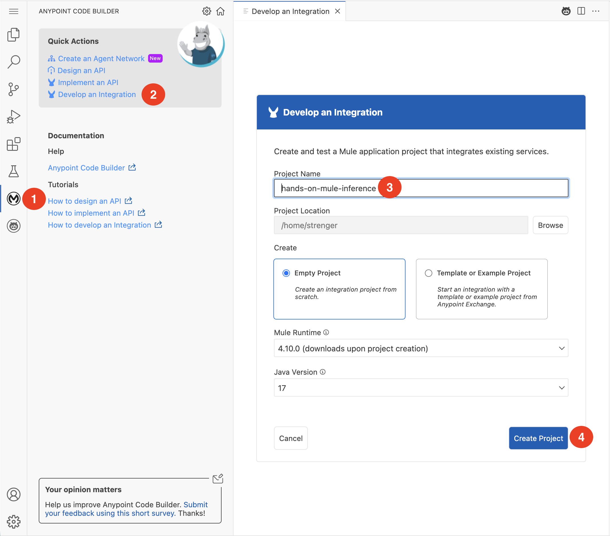

### 2. Crea un Flujo

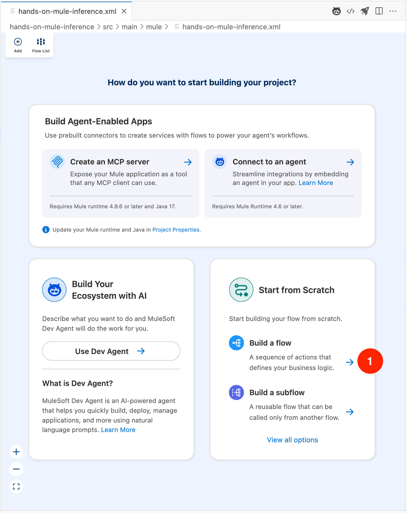

### 3. Agrega el conector HTTP Listner.

- Dale al `+` en tu canvas.
- Ve a la vista Mule Palette.
- Busca por `Connectors` -> `HTTP(5)`.
- Selecciona el component `Listner`.

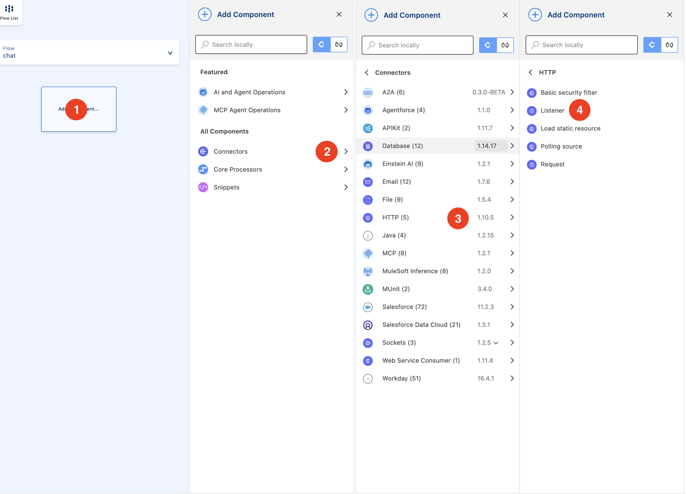

### 4. Configura el HTTP Listener
Selecciona el Listener y configura sus propiedades:

**Listener config (Configuración Global):**

- Haz clic en el signo `+` verde para crear una nueva configuración.
- **Host:** `0.0.0.0`
- **Port:** `8081`

**General (Propiedades del Listener):**
- **Path:** `/inference/chat`

**Advanced:**
- **Allowed Methods (Métodos permitidos):** POST

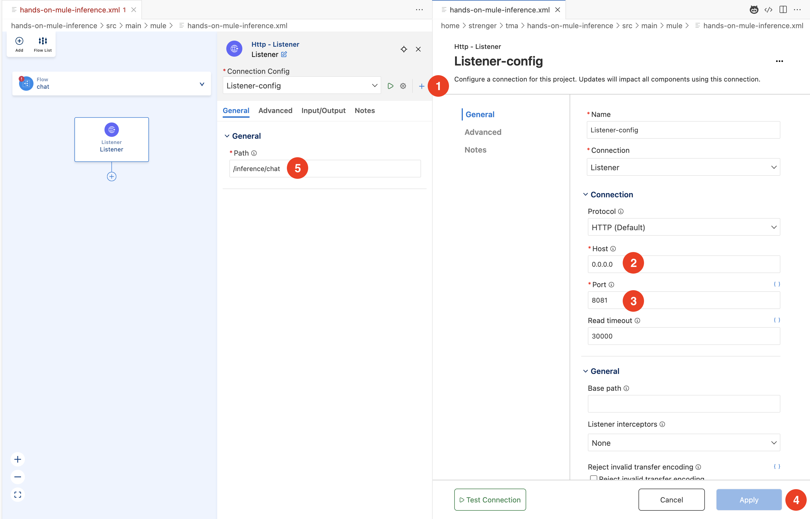

### 5. Agrega el conector Inference desde Exchange

- Dale al `+` en tu flujo después del **Listener**, pra agregar el conector Inference .
- Ve a la vista Mule Palette.
- Busca por `Inference Connector` in Exchange.
- Selecciona el connector `Inference Connector - Mule 4 1.2.0`

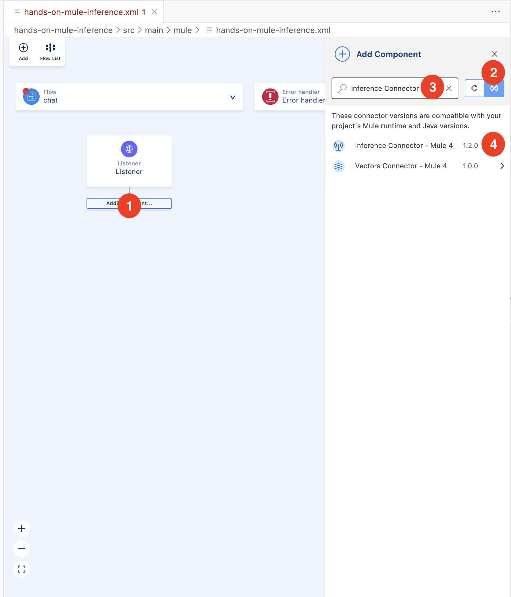

### 6. Agrega la operación [Chat] Completions

- Ve a la vista Mule Palette.
- Busca y selecciona la operación `[Chat] Completions`.

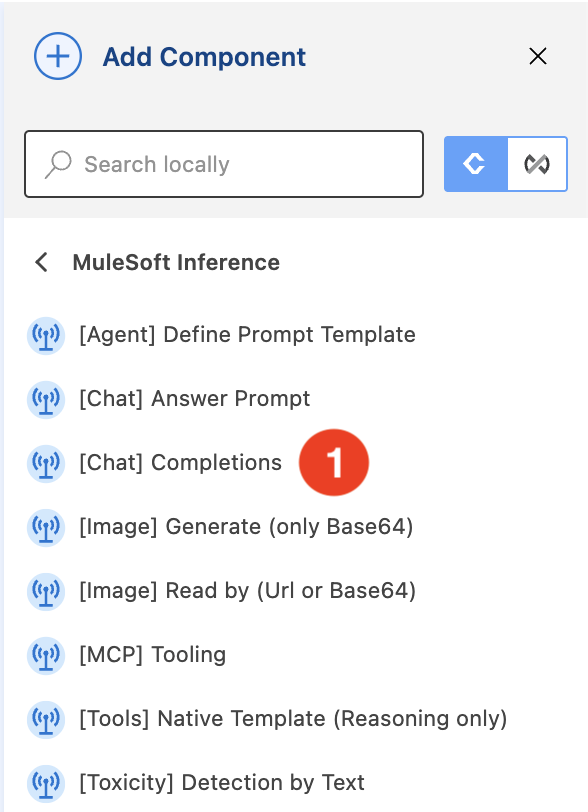

### 7. Configura la conexión de Inference

Selecciona la operación `Chat Completions`en tu canvas y configura sus propiedades:

**Connector configuration (Configuración Global):**
  - Haz clic en el signo `+` para crear una nueva configuración.
  - **Connection:** OpenAI
  - **Open ai model name:** gpt-4o-mini
  - **API Key:** (proporcionada por el equipo MAC)
  - Haz clic en **Test Connection**... para verificar ✅

**General (Propiedades de la operación):**
 - **Messages:** `payload.messages`

 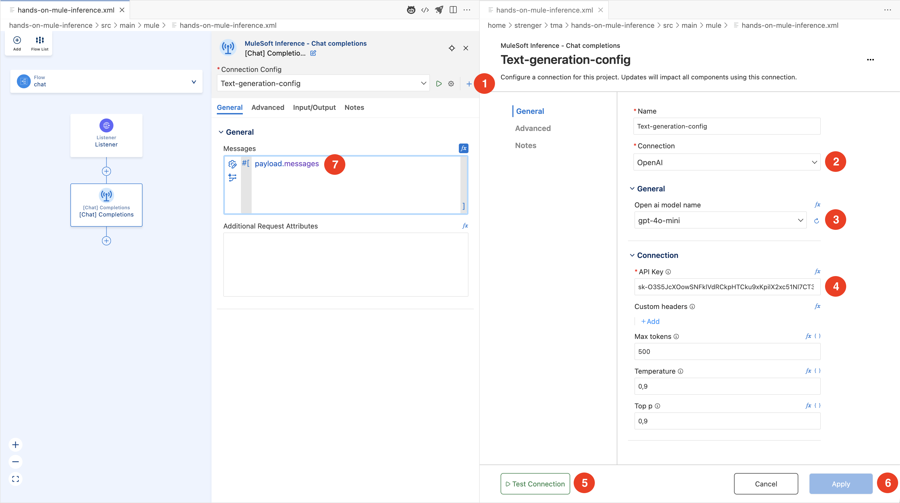

### 8. Agrega un Transform Message para preparar la respuesta.

- Dale al `+` en tu flujo después del **Chat Completions**, pra agregar el **Transform Message** .
- Ve al **Serach** en la vista Mule Palette.
- Busca y selecciona el component `Transform Message`.

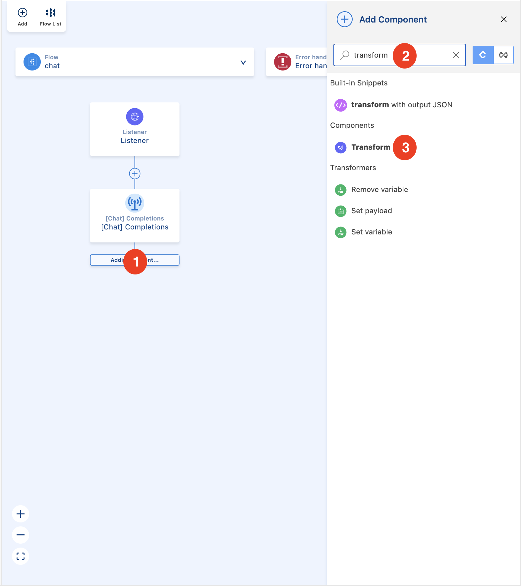

- Pega el siguiente script de DataWeave:

```dataweave
%dw 2.0
output application/json
---
{
  payload: payload,
  attributes: attributes
}
```

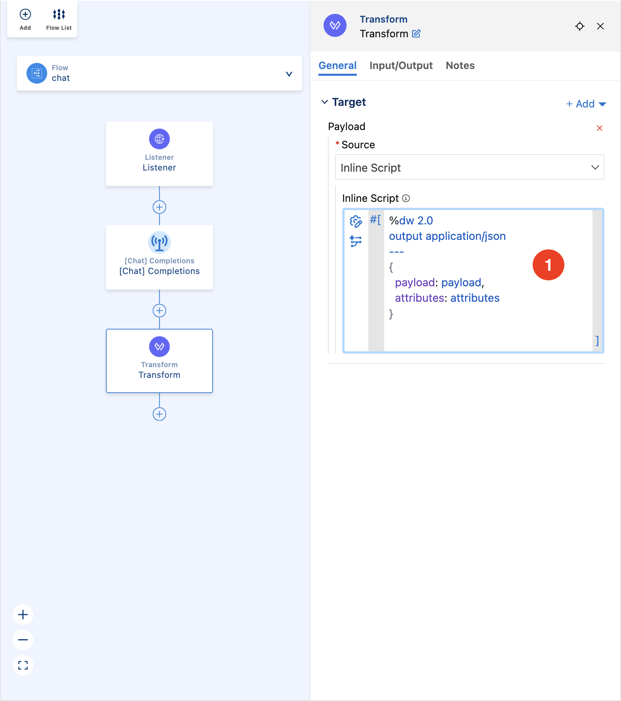

### 9. Ejecuta localmente en la terminal de ACB
Vamos a ejecutar el proyecto usando la interfaz gráfica de depuración de VS Code.

-  Abre la vista "Ejecutar y Depurar" En la barra de actividades (la barra de iconos en el extremo izquierdo de VS Code), haz clic en el icono Ejecutar y Depurar (el que parece un botón de 'play' con un bicho).
-  Inicia el proyecto En la parte superior del panel lateral que se abrió, verás un botón verde de "Play" (generalmente dice "Iniciar depuración") al lado de una configuración llamada MuleSoft: Debug.
- Haz clic en ese botón verde de "Play" para iniciar el proyecto.

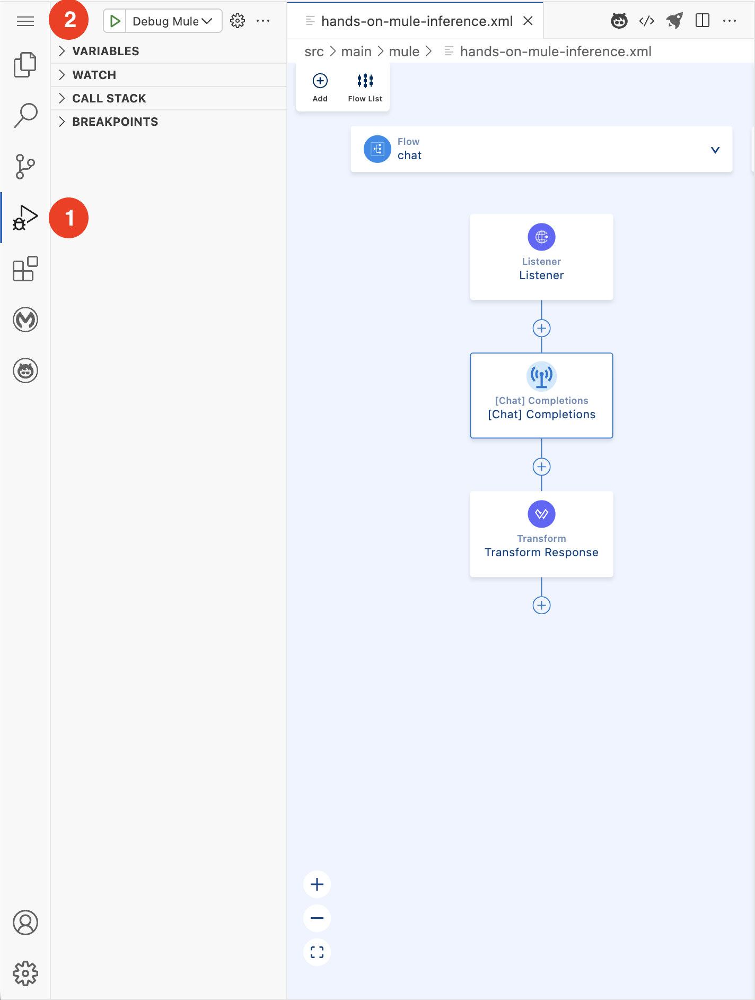

- Monitorea la terminal VS Code abrirá automáticamente el panel "TERMINAL" en la parte inferior y comenzará a construir e implementar (deploy) la aplicación. Espera a que la aplicación se inicie por completo.

Sabrás que está lista cuando veas el mensaje: 

```*******************************************************************************************************
*            - - + APPLICATION + - -            *       - - + DOMAIN + - -       * - - + STATUS + - - *
*******************************************************************************************************
* hands-on-mule-inference-1.0.0-SNAPSHOT-mule-a * default                        * DEPLOYED           *
*******************************************************************************************************
```

- Abre una nueva terminal para la prueba, la aplicación Mule ahora está ocupando esa pestaña de terminal. Para probarla, necesitas una nueva terminal para enviar tu comando curl.

En el mismo panel inferior, haz clic en el icono + (Nueva Terminal) para abrir una segunda pestaña de terminal.

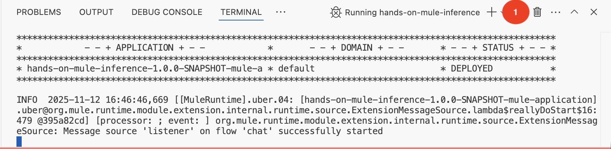

**Ejemplo de solicitud:**

```bash
curl --location 'localhost:8081/inference/chat' \
--header 'Content-Type: application/json' \
--data '{
  "messages": [
    { "role": "user", "content": "What is the capital of Switzerland?" }
  ]
}'
```

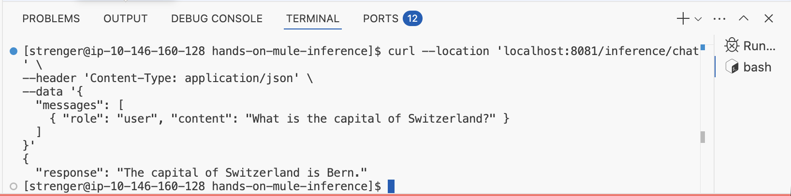

---

---

## ✨ ¡Listo!

Ahora tienes un agente conversacional en Mule.

---
